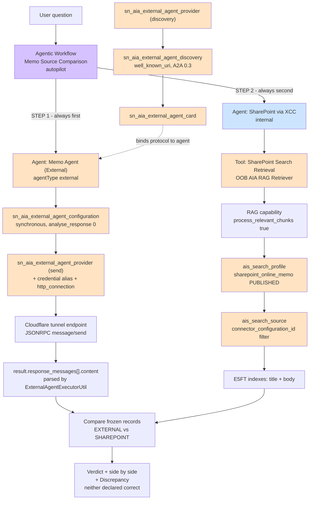

# a2a lf — Memo Source Comparison

Two independent memo sources asked the same question and compared: SharePoint content indexed in ServiceNow via the External Content Connector (XCC), and an external agent reached over the Agent2Agent (A2A) protocol.

- **App:** a2a lf
- **Scope:** `x_snc_a2a_lf` (`19be743947d78750037d0fadf26d4335`)

| Source file | Contains |
|---|---|
| `src/fluent/sharepoint-via-xcc-agent.now.ts` | SharePoint via XCC agent (tool is instance-only) |
| `src/fluent/memo-source-comparison-workflow.now.ts` | Memo Source Comparison workflow |
| `external-agent/` | Memo Agent (External) — standalone Python A2A server, not part of the ServiceNow instance or Fluent app |

The external agent is **not** in Fluent — see "Manual steps" below.

---

## Architecture



Purple = workflow (Fluent). Blue = `x_snc_a2a_lf` (Fluent). Orange = Global instance records, not in Fluent.

**External agent runs first, deliberately** — so its figures enter context before any SharePoint figures exist.

---

## Records

### In `x_snc_a2a_lf` (Fluent-managed)

| Record | Table | sys_id |
|---|---|---|
| Memo Source Comparison | `sn_aia_usecase` | `674d860d69cd490eb904bd967fb8bf3d` |
| Workflow config override (holds `active`) | `sn_aia_usecase_config_override` | `b938b4263aed472cbc71d4a0e739f9e6` |
| Team | `sn_aia_team` | `544e2cc471064c90ae750ef371cd18eb` |
| SharePoint via XCC | `sn_aia_agent` | `a44df5ca63a24e3785d713ddbdbb7254` |
| SharePoint agent ACL | `sys_security_acl` | `b9c9b6246842400db801ef9743aaf5da` |

### Global instance records (not in Fluent)

| Record | Table | sys_id |
|---|---|---|
| SharePoint Search Retrieval tool | `sn_aia_agent_tool_m2m` | `2643ee393bdf8b50a0db3141a3e45a54` |
| sharepoint_online_memo | `ais_search_profile` | `7452cdf5475b8750037d0fadf26d4324` |
| SharePoint Online Memo | `ais_search_source` | `245364f547174750037d0fadf26d435c` |
| Profile ↔ source link | `ais_search_profile_ais_search_source_m2m` | `f852cdf5475b8750037d0fadf26d435f` |
| Memo Agent (External) | `sn_aia_agent` | `39dd3a713b930f50a0db3141a3e45a23` |
| Agent config | `sn_aia_agent_config` | `b9dd72b13b930f50a0db3141a3e45a2b` |
| Version 1 | `sn_aia_version` | `f1dd3a713b930f50a0db3141a3e45a28` |
| External configuration | `sn_aia_external_agent_configuration` | `6eddb2b13b930f50a0db3141a3e45a46` |
| Provider (send) | `sn_aia_external_agent_provider` | `b24ee23d3b1bcb50a0db3141a3e45a23` |
| Provider (discovery) | `sn_aia_external_agent_provider` | `e3607a713b9bcb50a0db3141a3e45a32` |
| Discovery | `sn_aia_external_agent_discovery` | `b41036bd3b5bcb50a0db3141a3e45aa1` |
| Card | `sn_aia_external_agent_card` | `3add3ebd3b530f50a0db3141a3e45a9b` |
| Alias "Blank for Testing" | `sys_alias` | `9bf6a6f53b93cb50a0db3141a3e45a6a` |
| Connection "Memo Agent A2A Send" | `http_connection` | `074c1b393b1b4f50a0db3141a3e45a4c` |

### Pre-existing, untouched

| Record | sys_id |
|---|---|
| Connector config "SharePoint Online Memo" | `7672a43547d34750037d0fadf26d43d9` |
| Datasource "SharePoint Online" | `cb2cc1ac83f51210560c06c0522bc09c` |
| OOB AIA RAG Retriever | `8021ddea2b0d52101d72fb466e91bfd1` |
| RAG capability | `5345d14277e81210e9c41345ba5a9933` |
| Agent2Agent (A2A) protocol | `3799a4ceffc66e10d635ffffffffffb9` |
| Manual integration protocol (not used here) | `49e92cceffc66e10d635ffffffffff83` |
| External AI Agent Card subflow | `5826f16dff82621078a6ffffffffffda` |
| External AI Agent Provider subflow (`sn_aia.ai_agent__a2a_protocol`) | `1f6acb7eff426e50d635ffffffffffd9` |
| `admin` role | `2831a114c611228501d4ea6c309d626d` |

---

## Configuration

Workflow and SharePoint agent: `recordType: custom`, Dynamic User (`runAsUser`/`runAs` blank) with `dataAccess.roleMap: ['admin']`, `securityAcl` = Specific role → `admin` (operation `execute`).

### Workflow — Memo Source Comparison

`executionMode: autopilot`, `memoryScope: global`, no triggers. Team members are deployed **sys_ids** — names and `Now.ID` are rejected.

Orchestration, in order:

1. **Mandatory agent sequence** stated up front — Memo Agent (External) first, SharePoint via XCC second.
2. `Finish` is **forbidden** until both agents have responded. Prose-only step ordering is not enough; the ReAct loop will call one agent and finish (see "Orchestration" below).
3. External answer is captured and **frozen** before SharePoint runs.
4. Classify DISAGREE / AGREE / PARTIAL; differing figures are stated to be a normal outcome.
5. Side-by-side with each source showing only its own values; neither declared authoritative.

### Agent — SharePoint via XCC

Tool `SharePoint Search Retrieval` (instance-only): `hybrid`, profile `sharepoint_online_memo`, indexes `title`+`body`, `document_match_threshold: 0`, `search_results_limit: 10`, `display_output: true`, `outputTransformationStrategy: none`, `requires_widget_transformation: false`, plus the chunk inputs below.

Instructions extract 1–2 keywords (never a sentence), discard document-library/site-page hits, answer only from returned content.

### Agent — Memo Agent (External)

Instance-only. `agentType: external`, channel `nap_and_va`, version published and set as `current_version`, both `applicability_script` fields **empty**, `analyse_response: 0`, `synchronous: 1`.

Provider: Well-Known URI discovery, A2A protocol 0.3, JSONRPC binding, `version: v1`, `api_type: sys_hub_flow`.

---

## The A2A response contract

`sn_aia.ExternalAgentExecutorUtil` extracts the chat-displayable answer from one specific
shape:

```javascript
processExternalAgentResponse: function(payload, response) {
    var messages = JSON.parse(response).result.response_messages;
    return messages.map(item => item.content).join('\n');
}
```

**The external server needs to return `result.response_messages[].content`** alongside the
spec's `result.artifacts[].parts[].text`, or this parser has nothing to extract and the
orchestrator has no answer text for that agent's turn:

```json
"result": {
  "message":  { },
  "artifacts": [ ],
  "response_messages": [ { "content": "<same text as artifacts[0].parts[0].text>" } ]
}
```

`provider.transform_script` is a field on the provider record; it did not affect the response
in this setup, so reshaping happens on the external server side instead (see
`external-agent/README.md`).

**Recommended: keep `analyse_response = 0`.** With it set to `1`, an LLM pass runs over the
external agent's response with the other agent's answer already in context, which can lead it
to blend or restate figures rather than passing them through as-is — undesirable for a
side-by-side comparison use case like this one.

---

## Auth: none

The endpoint accepts no credentials, and `external_agent_id` is blank — the documented public-agent shape. `ExternalAgentExecutorUtil` pads the missing subflow inputs so the provider subflow's contract stays intact.

A credential alias **is** required regardless, because the send path resolves its destination through it. Alias `9bf6a6f5…` ("Blank for Testing") carries one `http_connection` with **no credential** and `connection_url` = the base URL.

> Do **not** blank `provider.connection_credential_alias` to work around a missing connection — fix the connection underneath it.

> `sys_alias` **refuses cross-scope create** from `x_snc_a2a_lf` and returns `null` with an empty error message. Create aliases in Global.

---

## Verification

Current host: see `http_connection` record `074c1b393b1b4f50a0db3141a3e45a4c` (changes whenever
the tunnel restarts — see "Tunnel host change" below).

### External agent — direct A2A JSONRPC

```javascript
var body = {
  jsonrpc: '2.0', id: 'sn-test-1', method: 'message/send',
  params: { message: {
    role: 'user',
    parts: [{ kind: 'text', text: 'What is the total authorised spend for the European product launch?' }],
    messageId: 'msg-sn-test-1'
  }}
};
var rm = new sn_ws.RESTMessageV2();
rm.setHttpMethod('post');
rm.setEndpoint('<current-tunnel-base-url>');  // see http_connection 074c1b393b1b4f50a0db3141a3e45a4c
rm.setRequestHeader('Content-Type', 'application/json');
rm.setRequestBody(JSON.stringify(body));
var resp = rm.execute();
var j = JSON.parse(resp.getBody());
gs.info('result keys: ' + Object.keys(j.result).join(', '));
gs.info('response_messages present? ' + (j.result.response_messages !== undefined));
```

Expected: HTTP 200, `result` keys include **`response_messages`**, content contains `$585,000`.

### Discovery

```javascript
new sn_aia.ExternalAgentGuidedSetupUtil()
  .discoverAgents('b41036bd3b5bcb50a0db3141a3e45aa1', '');
```

Expected: `success: true`, `Memo Agent` v0.1.0, skill `memo_qa`.

### Protocol binding

```javascript
gs.info(JSON.stringify(new sn_aia.ExternalAgentGuidedSetupUtil()
  .findAgentTypeWithProtocol('39dd3a713b930f50a0db3141a3e45a23')));
// expect 3799a4ceffc66e10d635ffffffffffb9 (A2A), NOT 49e92cceffc66e10d635ffffffffff83 (Manual)
```

### SharePoint retrieval

Invoke capability `5345d14277e81210e9c41345ba5a9933` with `search_profile: 'sharepoint_online_memo'` (by **name**), `search_type: 'hybrid'`, indexes `title`+`body`. Expected: `Strategic Memo - European Product Launch.pdf` at `0.8604`, body in `chunks[].chunk_text` (~1944 chars) containing `600,000`.

### Known disagreement

| Fact | SharePoint (XCC) | Memo Agent (A2A) |
|---|---|---|
| Baseline FY2025 | $550,000 | $525,000 |
| Supplemental | $50,000 (9.1%) | $60,000 (11.4%) |
| **Total authorised spend** | **$600,000** | **$585,000** |
| Memo date | February 8, 2025 | February 18, 2025 |
| First-mover risk | €15M | €12M |
| Source document | `…European Product Launch.pdf` | `european-launch.md` |

The two sources hold different revisions of the same memos. Surfacing that split is the workflow's purpose.

### Did the comparison actually happen?

Three checks, in order. Any one failing makes the verdict meaningless:

1. **A2A traffic** — `sn_aia_external_agent_exec_history` must show an **outbound** row *and* an **inbound** row with `state=completed` inside the run window. Outbound-only with null `state` = send failed. No rows = the orchestrator never dispatched.
2. **Task output** — the `sn_aia_execution_task` row whose `target_document_id` is the external agent must contain `585,000`. If it contains `600,000`, the response was lost or rewritten.
3. **Orchestrator scratchpad** — the `type=agent` / Orchestrator task output must show an `Action` naming **Memo Agent (External)**. If it goes straight from SharePoint to `Finish`, the sequence gate is not holding.

```javascript
var p = new GlideRecord('sn_aia_execution_plan');
p.addQuery('usecase', '674d860d69cd490eb904bd967fb8bf3d');
p.orderByDesc('sys_created_on');
p.setLimit(1);
p.query();
if (p.next()) {
  var t = new GlideRecord('sn_aia_execution_task');
  t.addQuery('execution_plan', p.getValue('sys_id'));
  t.addQuery('target_document_id', '39dd3a713b930f50a0db3141a3e45a23');
  t.query();
  while (t.next()) {
    var o = t.getValue('output') || '';
    gs.info('external task: has585=' + (o.indexOf('585,000') > -1) +
            ' has600=' + (o.indexOf('600,000') > -1));
  }
}
```

### Manual subflow invocation does not work

`sn_aia.ai_agent__a2a_protocol` invoked standalone fails with *"the inputs provided to the subflow … are incorrect"* — it expects the full orchestration contract. Not a usable test harness. Use Playground.

---

## Orchestration

The ReAct loop **will stop after one agent** if the instructions only describe steps in prose. Observed scratchpad from a failed run:

```
Action: SharePoint via XCC
Action: Finish — "mission is complete"
```

No external agent action was ever issued; the final answer was composed from SharePoint alone and attributed to both sources. Requirements that make it hold:

- State the mandatory agent sequence as an explicit numbered list at the very top of the instructions.
- Forbid `Finish` until **both** agents have responded, and say what to do instead.
- Call the external agent **first**, so its figures cannot be contaminated by the other source's answer.
- Freeze each agent's answer as a named record and forbid revising one based on the other.

Do **not** use filename heuristics (`.pdf` vs `.md`) as an integrity check. That produced a misleading "source integrity concern" verdict that described a citation mismatch when the real fault was the external response never arriving.

---

## Platform behaviours

**`ais_*` and `sn_aia_external_agent_*` tables force `sys_scope=Global`** regardless of the running scope.

**Explicit `sys_id` on insert is refused cross-scope.** `setValue('sys_id', …)` from `x_snc_a2a_lf` is silently ignored — the platform assigns its own. Read the sys_id back; never trust the intended value.

**Profile name derives from the label, not the supplied name.** Inserting `name: 'x_snc_a2a_lf_sharepoint_memo'` with `label: 'SharePoint Online Memo'` produced `name=sharepoint_online_memo`. Read it back before publishing:

```javascript
var g = new GlideRecord('ais_search_profile');
g.get('7452cdf5475b8750037d0fadf26d4324');
new sn_ais.Synchronizer().publishProfile(g.getValue('name'));
```

Publishing under the wrong name fails silently (`Cannot find AIS search profile with name <x>: no thrown error`), leaving `state=NEW`. Confirm `state=PUBLISHED` and a non-null `publish_id`.

**Search profiles must be referenced by name.** A profile sys_id throws `InvalidSearchConfigException: Invalid search profile value`.

**Chunk text is gated in the agent runtime.** `sn_aia.AIAToolExecutorUtil`:

```javascript
var processChunksEnabled = false; // default OFF
processChunksEnabled = inputsMap.process_relevant_chunks === true ||
                       inputsMap.process_relevant_chunks === 'true';
...
if (!processChunksEnabled) {
    delete item.chunks;   // removed before the agent sees it
}
```

Without `process_relevant_chunks`, the agent receives `title`, `url` and `columns` only — file names with no body — even though the capability returned full chunk text. Symptom: agent says *"unable to retrieve the body content"* while raw tool output visibly contains the right documents. There is no `include_chunks` parameter.

**Arbitrary inputs are forwarded.** `AIAToolExecutorSNC._getRAGRefinedRequest` copies every entry in the tool's `inputs` array into `tool_data.inputs` (all except `query`). Input names beyond Fluent's `RagInputType` therefore reach the capability.

### Required tool inputs for chunk text

| Input | Value | Consumed by |
|---|---|---|
| `process_relevant_chunks` | `'true'` | Agent runtime — without it, `chunks` is deleted |
| `chunking_mode` | `SMALL_TO_BIG` | RAG capability |
| `chunk_unit` | `WORDS` | RAG capability |
| `chunk_size` | `750` | RAG capability |
| `expanded_snippet_size` | `750` | RAG capability |

None are expressible in Fluent (`RagInputType` has no chunk properties), which is why the tool is instance-only. Re-apply after any change to the tool record:

```javascript
var m = new GlideRecord('sn_aia_agent_tool_m2m');
m.get('2643ee393bdf8b50a0db3141a3e45a54');
var inputs = JSON.parse(m.getValue('inputs') || '[]');
function upsert(n, v) {
  for (var i = 0; i < inputs.length; i++) if (inputs[i].name === n) { inputs[i].value = v; return; }
  inputs.push({ name: n, value: v });
}
upsert('process_relevant_chunks', 'true');
upsert('chunking_mode', 'SMALL_TO_BIG');
upsert('chunk_unit', 'WORDS');
upsert('chunk_size', '750');
upsert('expanded_snippet_size', '750');
m.setValue('inputs', JSON.stringify(inputs));
m.setValue('requires_widget_transformation', false);
m.setValue('widgets', '');
m.update();
```

**Declaring the RAG tool in Fluent deletes and recreates it**, wiping those inputs and returning the agent to file-names-only. `requires_widget_transformation` is also absent from Fluent's `RagToolDetails`. Hence instance-only.

**`sn_aia_usecase.active` stays null** and is not writable — workflow activation lives on `sn_aia_usecase_config_override.active`. Agent activation lives on `sn_aia_agent_config.active`, not `sn_aia_agent`.

**Index noise.** SharePoint document libraries and site pages are indexed alongside real documents and return at ~0.65 similarity with title-only content (`Events`, `Site Assets`, `Home`, `Content scheduler`, `Communication site`, `Project plan`). The SharePoint agent's filtering step handles this — do not remove it.

**Case differs by layer.** Tool `inputs` use lowercase `hybrid` and `search_results_limit`. Direct capability calls accept `Hybrid` and use `limit`.

**The schema table is empty by design.** `sn_ext_conn_spo_external_search_schema` holds one placeholder row stating documents live in the AI Search index. Row counts do not indicate crawl status — verify via retrieval.

**Known cosmetic defect.** Agent output prepends the instance URL to already-absolute SharePoint links (`…service-now.com<instance-base-url>`). The capability returns a clean URL; `AIAToolExecutorUtil` has an `isAbsoluteUrl` guard that fires anyway. Links in agent answers render broken.

---

## Manual steps — external A2A agent (NOT in Fluent)

The server itself — code, run/tunnel instructions, and the three ServiceNow-specific fixes
it needed to accept real requests — lives in [`external-agent/`](external-agent/README.md).
This section covers the ServiceNow-side registration only.

External A2A registration has **no Fluent API**. Instance-only, Global-scoped:

`sn_aia_external_agent_provider` · `_discovery` · `_card` · `_skill` · `_configuration` · `sys_alias` · `http_connection`

The workflow references the external agent by **sys_id** in `team.members`. Recreating the agent gives it a new sys_id — update that array and rebuild.

> **Do not author the external agent in Fluent.** `versionDetails` coalesces on `target_id` + `version_name` and will overwrite the published-version and applicability fixes below, re-breaking it.

### Two providers are required — one field, two subflows

| Purpose | `api` | Subflow |
|---|---|---|
| Send / execute | `1f6acb7eff426e50d635ffffffffffd9` | External AI Agent Provider - A2A Protocol |
| Card discovery | `5826f16dff82621078a6ffffffffffda` | External AI Agent Card - A2A Protocol |

Pointing the discovery record at the send provider fails with *"the inputs provided to the subflow … are incorrect"*.

### Setup issues encountered and their fixes

Each one alone is enough to keep the agent from working. All were resolved by script.

| Symptom | Cause | Fix |
|---|---|---|
| "deprecated Manual Integration protocol" | no `sn_aia_external_agent_discovery` row → protocol defaults to Manual | create row: `protocol` = A2A, `type` = `well_known_uri`, `active` = true |
| Agent card blank / "Added to Instance: No" | `provider.agent_card_url` null | set it, then run discovery |
| "problem on my side", agent task `cancelled`, zero `sn_aia_tools_execution` rows | `sn_aia_version.applicability_script` = template `inputs.channel == 'ALL'` **and** `sn_aia_agent.applicability_script` = template `return false` | clear **both** |
| Same symptom | version `state` = `committed`, `agent_config.current_version` null | set `published`, set `current_version` |
| Request never leaves ServiceNow, ~10s then empty output | credential alias had **zero** `http_connection` rows → send has no destination | create connection under the alias, `connection_url` = **base** URL |
| Agent `channel` null | wizard didn't set it | `nap_and_va` |
| Card exists but not bound to agent | `card.agent` null | set it to the agent sys_id |

`connection_url` must be the base URL. JSONRPC `message/send` POSTs to the root — a `/.well-known/agent-card.json` path breaks the send.

### Tunnel host change

Cloudflare quick-tunnel hostnames are not stable — they can expire without warning even if
the local process is still running. Check the current one before assuming a failure is
config-related: `curl -o /dev/null -w '%{http_code}' <host>/.well-known/agent-card.json`.
When it changes, update every record below.

```javascript
var BASE = 'https://<new-host>.trycloudflare.com';
var HOST = '<new-host>.trycloudflare.com';

var p = new GlideRecord('sn_aia_external_agent_provider');
p.addEncodedQuery('agent_card_urlLIKEtrycloudflare');
p.query();
while (p.next()) { p.setValue('agent_card_url', BASE + '/.well-known/agent-card.json'); p.update(); }

var c = new GlideRecord('http_connection');
c.get('074c1b393b1b4f50a0db3141a3e45a4c');
c.setValue('host', HOST);
c.setValue('connection_url', BASE);   // base URL, no path
c.update();

var cd = new GlideRecord('sn_aia_external_agent_card');
cd.get('3add3ebd3b530f50a0db3141a3e45a9b');
cd.setValue('url', BASE);
cd.update();
```

Then re-run discovery and confirm `success: true`.

### Leftovers to prune

Superseded agents: `590feaf13b5bcb50a0db3141a3e45ac6`, `2e0daa3d3bd7cb50a0db3141a3e45a8d`. Stale connections on dead hosts: "Blank for Testing Connection", "Memo Agent (A2A) Connection". Unused provider `720dae3d3bd7cb50a0db3141a3e45a0c` and its discovery rows.

---

## Rebuild

```
build → install
```

Then confirm the RAG tool's chunk inputs are intact (script above). The AI Search and external-agent records are Global and are **not** recreated by a rebuild — recreate them manually on a fresh instance.
